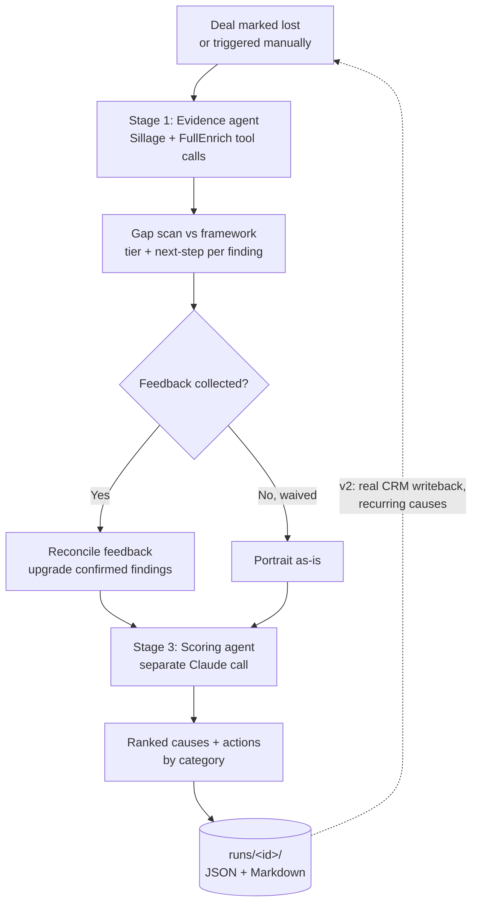

# StopMortem

> An agent that turns every lost deal into a scored, comprehensive and cross referenced post-mortem and reusable corrective actions — so the sales team stops losing the same way twice.

**Status:** v1 working prototype. HubSpot is fully faked (rich local fixtures stand in for the CRM); Sillage and FullEnrich are real, live integrations.

**Built for:** the go-to-market teams of cloud-native SaaS companies — StopMortem is our product; they are who we build it for.

---

## Why this exists

`StopMortem` fixes the learning loop, not the losing. Every lost deal is analysed against what a well-qualified, winnable deal should have looked like; the agent produces ranked, evidence-backed root causes; and each non-speculative cause becomes a corrective action the team can reuse. Over time, the action that keeps recurring is the mistake worth fixing first.

---

## Personas

| Persona | Role in the system |
| --- | --- |
| **Lola — Sales** | Primary user. Runs the deal, owns the qualification, validates the post-mortem, decides ambiguous merges. The agent drafts; Lola approves anything client-facing. |
| **Pre-Sales** | Partners with Sales on qualification and technical scoping. Reads the post-mortems to catch scoping and solutioning gaps before the next deal repeats them. |
| **Product** | Consumes the recurring-cause view. When losses cluster around a missing capability or a repeated objection, Product feeds it into the roadmap — continuous improvement driven by why deals are actually lost. |
| **Client — DSI, CTO, CIO, CEO, Founders** | The buying committee on the other side. The agent reasons about *which* of these was (or wasn't) engaged — a missing economic buyer is one of the most common root causes it looks for. |

---

## What it does (v1)

1. Runs against a lost deal — triggered manually (`node scripts/run-demo.mjs --deal <id>`) or via the HTTP API (`POST /api/deals/:id/run`). A real HubSpot-triggered workflow is future work; v1 reads from local fixture data standing in for the CRM.
2. **Stage 1 — evidence agent.** A Claude tool-calling agent reconstructs the deal from its own evidence (qualification notes, activity, proposal, org context) and builds a complete picture using **real, live Sillage and FullEnrich API calls** — company enrichment, stakeholder identification, competitive context. This stage does not draw conclusions; it only gathers and tags evidence.
3. Within that same stage, it runs a gap scan against a qualification framework (MEDDPICC is the demo instance — swappable via `config/frameworks/`, not hardcoded) and tags each finding as a **documented gap**, an **evidence conflict**, or an **inferred hypothesis**, plus a recommended next step (no further investigation / internal follow-up / client call / full third-party review — thresholds are configurable, not inlined).
4. **Feedback (optional, waivable).** Client feedback can upgrade an inferred hypothesis to a confirmed fact. Skippable per-run (`--waive-feedback`).
5. **Stage 3 — scoring agent.** A *separate* Claude call ranks the resulting root causes using a deterministic rubric (evidence tier × causal weight × corroboration — computed in code, not by the LLM), explains the top cause with evidence citations, and proposes remedial actions by category. Speculative (grey) findings are never turned into actions.
6. The finished post-mortem is written to `runs/<runId>/` (JSON + Markdown). Real CRM/data-platform writeback is future work — see Roadmap.

---

## How it works



The dashed line is the direction of travel: v1 stops at local output; v2 closes the loop back into a real CRM and surfaces recurring causes at the next deal's qualification stage.

---

## The root-cause engine

The scan walks each framework dimension and asks two questions: *was it captured?* and *does the rest of the evidence agree with it?* The answer determines which confidence tier the cause lands in.

| Tier | Colour | What it means | Example |
| --- | --- | --- | --- |
| **Documented gap** | green | A required dimension is missing from the notes. This is a fact, not a guess — thin qualification becomes the finding. | Budget was never captured. |
| **Evidence conflict** | amber | The dimension was captured, but the proposal or activity contradicts it. | Proposal priced above the budget recorded in discovery. |
| **Inferred hypothesis** | grey | Nothing in the evidence speaks to it; the agent inferred it. Flagged, never actioned until confirmed. | Competitor may have had an incumbent advantage. |

The recorded "closed lost" reason is treated as a **claim to verify**, not ground truth. If the evidence disagrees with the rep's stated reason, the agent says so.

Client feedback, when collected, **upgrades any tier to confirmed** — see `pipeline/feedback.js`.

---

## Scoring

"Best root cause" is decided by a deterministic rubric (`pipeline/scoring.js`, `config/scoring-rubric.json`), not by the LLM inventing numbers — evidence strength (tier) × causal weight (per-dimension, from the framework config) + a corroboration bonus (more independent citations = stronger). Stage 3's Claude call receives these precomputed scores and is asked to rank, explain, and cite — not to do the arithmetic.

Each cause ships with a one-line explanation that **cites the evidence** rather than asserting a conclusion.

---

## Actions and the playbook

Every non-speculative cause (green and amber only) becomes a remedial action, grouped by category. Grey hypotheses stay diagnosed but un-actioned until confirmed.

**v1** writes the post-mortem and its actions to local files (`runs/<runId>/portrait.json`, `postmortem.json`, `report.md`). No cross-deal counting yet — the deliverable is a rigorous, evidence-backed autopsy per lost deal.

**v2** introduces the counted, deduplicated playbook — see Roadmap.

---

## Guardrails

- **Human in the loop on anything client-facing.** The agent never contacts a client on its own; a real feedback-collection flow is future work.
- **Speculative causes are never coached on.** Grey tier is clearly labelled and excluded from actions — enforced structurally in `pipeline/feedback.js` and `pipeline/stage3-scoring.js`, not just by convention.
- **The dropdown is not trusted.** Loss reasons are derived from evidence (`claimUnderReview` in the portrait).

---

## Architecture and stack

No external orchestration engine for the agent logic itself. `pipeline/index.js` is the orchestrator; a real HubSpot-triggered webhook/serverless host is future work (see Roadmap) — v1 is invoked via CLI or the local HTTP API.

| Tool | Role | Status in v1 |
| --- | --- | --- |
| **Claude** (Anthropic Messages API, tool use) | Stage 1 evidence-gathering agent (`claude-sonnet-5`) and Stage 3 scoring/synthesis agent (`claude-opus-4-8`) — two separate calls connected by a persisted JSON contract (the "deal portrait"). | Implemented |
| **Sillage** | Company enrichment via the Top Account List (add/poll/fetch), plus optional workspace signals and persona context. REST, not MCP — Sillage's MCP requires interactive OAuth incompatible with a headless pipeline; direct MCP access remains a separate, Claude-Code-only exploration channel. | Implemented, real API calls |
| **FullEnrich** | Company lookup, named-person lookup, company search, and reverse-email lookup for resolving stakeholders known only by title. (`people/search`'s filter wire format is undocumented and unresolved — dropped from v1.) | Implemented, real API calls |
| **HubSpot** | Not integrated. Local JSON fixtures (`fixtures/deals/`) stand in for the CRM. | Deferred to v2 |

See `CLAUDE.md` for the file layout and development commands.

---

## Roadmap

- **v1 (this repo)** — per-deal scored post-mortem with evidence-derived causes and corrective actions, backed by real Sillage/FullEnrich calls, written to local output. HubSpot fully faked via fixtures.
- **v2** — real HubSpot integration (read qualification/activity/proposal from the actual CRM, write the post-mortem and actions back to the deal record), the counted/semantically-deduplicated playbook (needs a place to accumulate entries — HubSpot custom object vs. Notion, still undecided), and closing the qualification feedback loop automatically.
- **Later** — live qualification scoring at the Qualification stage, so gaps are flagged *before* the deal is lost rather than diagnosed after.

---

## Repository layout

```
/
├── README.md               this file
├── CLAUDE.md                development guide for Claude Code
├── server.js                Express app — thin HTTP layer over pipeline/
├── routes/api.js            GET /api/deals, POST /api/deals/:id/run
├── public/index.html        minimal UI: pick a fixture deal, run, view the report
├── scripts/run-demo.mjs     CLI: node scripts/run-demo.mjs --deal <id> [--feedback <path> | --waive-feedback]
├── config/                  swappable framework (MEDDPICC), next-step thresholds, scoring rubric, model IDs
├── fixtures/deals/          fake CRM deal exports (5 example deals, real companies/execs for genuine enrichment)
├── fixtures/feedback/       example client-feedback fixtures
├── lib/sillage/, lib/fullenrich/   REST clients + Claude tool-use definitions
├── pipeline/                stage1-evidence.js, feedback.js, stage3-scoring.js, index.js (orchestrator), scoring/classification logic
├── output/                  Markdown rendering + writeback adapters (local-file only in v1)
└── runs/                    (gitignored) output of each pipeline run
```

---

## Open items to confirm

- How a real HubSpot workflow would invoke the agent (webhook endpoint / serverless host) — not yet built.
- Where v2 accumulates playbook entries (HubSpot custom object vs. Notion).
- The writeback shape on the real deal record (note vs. custom properties) once HubSpot integration is built.
