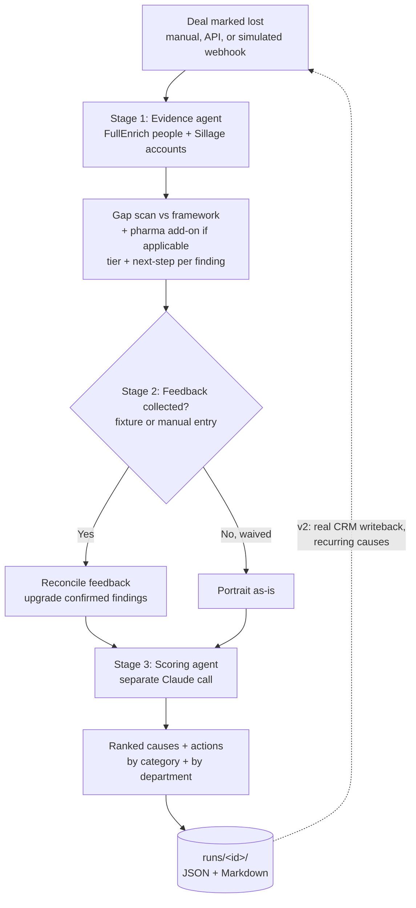

# StopMortem

> An agent that turns every lost deal into a scored, comprehensive and cross referenced post-mortem and reusable corrective actions — so the sales team stops losing the same way twice.

**Status:** v1 working prototype. HubSpot is fully faked (rich local fixtures stand in for the CRM); Sillage and FullEnrich are real, live integrations. A CRM "Closed Lost" trigger is simulated via a webhook-style endpoint (see below), not a real HubSpot workflow.

**Built for:** the go-to-market teams of cloud-native SaaS companies — StopMortem is our product; they are who we build it for.

---

## Why this exists

`StopMortem` fixes the learning loop, not the losing. Every lost deal is analysed against what a well-qualified, winnable deal should have looked like; the agent produces ranked, evidence-backed root causes; and each non-speculative cause becomes a corrective action the team can reuse. Over time, the action that keeps recurring is the mistake worth fixing first.

---

## Personas

| Persona | Role in the system |
| --- | --- |
| **Lola — Sales** | Primary user. Runs the deal, owns the qualification, validates the post-mortem, decides ambiguous merges. **In v1**, Lola is also the one who manually types in client/internal feedback (Stage 2's UI form) — there is no automated client-facing drafting flow yet; that's future work (see Guardrails). |
| **Pre-Sales** | Partners with Sales on qualification and technical scoping. Reads the post-mortems to catch scoping and solutioning gaps before the next deal repeats them. Gets a dedicated takeaway in every report's "By department" section. |
| **Product** | Consumes the recurring-cause view. When losses cluster around a missing capability or a repeated objection, Product feeds it into the roadmap. Also gets a dedicated "By department" takeaway per report. |
| **Client — DSI, CTO, CIO, CEO, Founders** | The buying committee on the other side. The agent reasons about *which* of these was (or wasn't) engaged — a missing economic buyer is one of the most common root causes it looks for. |

---

## What it does (v1)

1. Runs against a lost deal — triggered manually (`node scripts/run-demo.mjs --deal <id>`), via the HTTP API (`POST /api/deals/:id/run`), or via a simulated CRM auto-trigger (`POST /api/webhooks/deal-closed`, or the "Simulate CRM auto-trigger" button in the UI) that stands in for a real HubSpot "Closed Lost" workflow. v1 reads from local fixture data standing in for the CRM either way.
2. **Stage 1 — evidence agent.** A Claude tool-calling agent (`claude-sonnet-5`) reconstructs the deal from its own evidence (qualification notes, activity, proposal) and builds a complete picture. It uses **real, live FullEnrich calls** to resolve stakeholders (named-person lookup, reverse-email lookup for title-only contacts) and **real, live Sillage calls** for company-level enrichment (Top Account List) — Sillage enriches *accounts*, not *people*; person-level resolution is FullEnrich's job. This stage does not draw conclusions; it only gathers and tags evidence.
3. Within that same stage, it runs a gap scan against a qualification framework (MEDDPICC is the demo instance — swappable via `config/frameworks/`, not hardcoded) and tags each finding as a **documented gap**, an **evidence conflict**, or an **inferred hypothesis**. For deals in a regulated industry (`meta.industry: "life_sciences_pharma"` in the fixture — currently the Medidata Solutions deal), a *second*, independent compliance add-on framework (`config/frameworks/pharma-compliance-addon.json`) runs alongside it and is visually separated in the report — it never appears for a non-pharma deal. This is what makes "the framework is swappable" a demonstrated fact, not just an architecture claim.
4. Each finding also gets a deterministically-computed (code, not LLM) recommended next step: no further investigation / internal follow-up / client call / full third-party review — thresholds live in `config/next-step-thresholds.json`, not inlined in code.
5. **Stage 2 — Follow-up (optional, waivable).** Client or internal feedback can upgrade an inferred hypothesis to a confirmed fact. Two ways in: a pre-built fixture (`fixtures/feedback/<dealId>-feedback.json`, auto-loaded unless `--waive-feedback`), or a manual entry form in the UI — pick an unconfirmed finding, note what was actually said, submit. A manual submission re-runs only Stage 2 + Stage 3 (not Stage 1's tool-calling loop), so it's fast and doesn't re-spend Sillage/FullEnrich calls.
6. **Stage 3 — scoring agent.** A *separate* Claude call (`claude-opus-4-8`) ranks the resulting root causes using a deterministic rubric (evidence tier weight × causal weight + a corroboration bonus — computed in code, `pipeline/rubric-scoring.js`, not by the LLM), explains the top causes with evidence citations, proposes remedial actions grouped by category, and writes short department-specific takeaways (Sales / Pre-Sales / Product). Speculative (grey) findings are never turned into actions. This stage also produces a rolled-up "what happens next" view across every finding, and an optional one-sentence recovery note (see Guardrails — deliberately not a rescue plan).
7. The finished post-mortem is written to `runs/<runId>/` (JSON + Markdown) and reports where it was (or would be) distributed — see "Published to" in the report: the local file is real, HubSpot/Slack/Notion entries are clearly marked simulated, not faked as connected.

Every run keeps executing server-side regardless of the browser tab that started it — navigating away and back resumes showing progress or the finished result, it doesn't restart or disappear.

---

## How it works



The dashed line is the direction of travel: v1 stops at local output plus simulated publish targets; v2 closes the loop back into a real CRM and surfaces recurring causes at the next deal's qualification stage.

---

## The root-cause engine

The scan walks each framework dimension and asks two questions: *was it captured?* and *does the rest of the evidence agree with it?* The answer determines which confidence tier the cause lands in.

| Tier | Colour | What it means | Example |
| --- | --- | --- | --- |
| **Documented gap** | green | A required dimension is missing from the notes. This is a fact, not a guess — thin qualification becomes the finding. | Budget was never captured. |
| **Evidence conflict** | amber | The dimension was captured, but the proposal or activity contradicts it. | Proposal priced above the budget recorded in discovery. |
| **Inferred hypothesis** | grey | Nothing in the evidence speaks to it; the agent inferred it. Flagged, never actioned until confirmed. | Competitor may have had an incumbent advantage. |

The recorded "closed lost" reason is treated as a **claim to verify**, not ground truth. If the evidence disagrees with the rep's stated reason, the agent says so.

Feedback, when collected — via a fixture or the manual-entry form — **upgrades a tier to confirmed** — see `pipeline/feedback.js` (Stage 2).

### Pharma/life-sciences compliance add-on

Economic Buyer/Champion-style qualification (MEDDPICC's 8 dimensions) and a buying-committee's *roles* are two different, complementary things — MEDDPICC asks "was this dimension captured and consistent," not "who specifically holds this role." The pharma add-on (`config/frameworks/pharma-compliance-addon.json`) is a second, independent dimension list (21 CFR Part 11 compliance, data residency, validation documentation, formal security sign-off) that only activates when a deal's fixture sets `meta.industry: "life_sciences_pharma"`. Its findings are tagged with their own `frameworkId` and rendered in a visually distinct section — never mixed into the core MEDDPICC findings, never shown for a non-pharma deal.

---

## Scoring

"Best root cause" is decided by a deterministic rubric (`pipeline/rubric-scoring.js`, `config/scoring-rubric.json`), not by the LLM inventing numbers:

```
score = (evidenceTierWeight × dimensionCausalWeight) + corroborationBonus
```

— evidence tier weight and per-dimension causal weight (from whichever framework owns that dimension — core or add-on) multiply together, then a corroboration bonus (more independent citations = stronger, capped) is *added*. Stage 3's Claude call receives these precomputed scores and is asked to rank, explain, and cite — not to do the arithmetic. (Verified in practice: Stage 3's output scores are byte-identical to Stage 1's computed scores in every run.)

Each cause ships with a one-line explanation that **cites the evidence** rather than asserting a conclusion.

---

## Actions and the playbook

Every non-speculative cause (green and amber only) becomes a remedial action, grouped by category. Grey hypotheses stay diagnosed but un-actioned until confirmed.

**v1** writes the post-mortem and its actions to local files (`runs/<runId>/portrait.json`, `postmortem.json`, `report.md`), plus a "Published to" list — the local file is real; a HubSpot deal-record note, a Slack post, and a Notion recurring-causes append are explicitly marked *simulated*, not faked as already connected. No cross-deal counting yet — the deliverable is a rigorous, evidence-backed autopsy per lost deal.

**v2** introduces the counted, deduplicated playbook — see Roadmap.

---

## Guardrails

- **Human in the loop on anything client-facing.** The agent never contacts a client on its own. In v1, feedback collection is either a pre-written fixture or a rep typing a manual entry into the UI — there is no automated outreach-drafting flow.
- **Speculative causes are never coached on.** Grey tier is clearly labelled and excluded from actions — enforced structurally in `pipeline/feedback.js` and `pipeline/stage3-scoring.js`, not just by convention.
- **The dropdown is not trusted.** Loss reasons are derived from evidence (`claimUnderReview` in the portrait).
- **Rescue is explicitly out of scope.** StopMortem is a post-mortem tool, not a deal-rescue tool — deliberately, to keep the product focused (it competes on retrospective evidence rigor, not live win-probability scoring, where Gong/Clari/Aviso already play). The only trace of "can this still be saved" is `postmortem.recoveryNote` — one optional sentence, only when the evidence genuinely supports it, never a plan.

---

## Architecture and stack

No external orchestration engine for the agent logic itself. `pipeline/index.js` is the orchestrator; `pipeline/run-registry.js` decouples execution from any single HTTP request so a run survives navigation and can be triggered by a webhook. A real HubSpot-triggered workflow is future work (see Roadmap) — v1 is invoked via CLI, the local HTTP API, or the simulated webhook endpoint.

| Tool | Role | Status in v1 |
| --- | --- | --- |
| **Claude** (Anthropic Messages API, tool use) | Stage 1 evidence-gathering agent (`claude-sonnet-5`) and Stage 3 scoring/synthesis agent (`claude-opus-4-8`) — two separate calls connected by a persisted JSON contract (the "deal portrait"). | Implemented |
| **Sillage** | **Company-level** enrichment via the Top Account List (add/poll/fetch), plus optional workspace signals and persona context. Does not resolve individual people. REST, not MCP — Sillage's MCP requires interactive OAuth incompatible with a headless pipeline; direct MCP access remains a separate, Claude-Code-only exploration channel. | Implemented, real API calls |
| **FullEnrich** | **Person-level** resolution — named-person lookup, reverse-email lookup for stakeholders known only by title — plus company lookup/search. (`people/search`'s filter wire format is undocumented and unresolved — dropped from v1.) | Implemented, real API calls |
| **HubSpot** | Not integrated. Local JSON fixtures (`fixtures/deals/`) stand in for the CRM. The "Simulate CRM auto-trigger" button/webhook endpoint stands in for a real HubSpot workflow calling in. | Deferred to v2 |

See `CLAUDE.md` for the file layout and development commands, and `TECHNICAL-OVERVIEW.md` for a step-by-step technical walkthrough.

---

## Roadmap

- **v1 (this repo)** — per-deal scored post-mortem with evidence-derived causes and corrective actions, backed by real Sillage/FullEnrich calls, written to local output with simulated publish targets. HubSpot fully faked via fixtures; its trigger simulated via a webhook endpoint.
- **v2** — real HubSpot integration (read qualification/activity/proposal from the actual CRM, write the post-mortem and actions back to the deal record — replacing the simulated publish target with a real one behind the same `WritebackAdapter` contract), the counted/semantically-deduplicated playbook (needs a place to accumulate entries — HubSpot custom object vs. Notion, still undecided), and closing the qualification feedback loop automatically.
- **Later** — live qualification scoring at the Qualification stage, so gaps are flagged *before* the deal is lost rather than diagnosed after.

---

## Repository layout

```
/
├── README.md                       this file
├── CLAUDE.md                       development guide for Claude Code
├── TECHNICAL-OVERVIEW.md           step-by-step technical walkthrough
├── DATA-SOURCES.md                 what's real vs. fabricated, per integration and per fixture
├── server.js                       Express app — thin HTTP layer over pipeline/
├── routes/api.js                   deals, run, feedback, webhook, status, runs endpoints
├── public/                         index.html, style.css, app.js — tabbed per-deal UI, no build step
├── scripts/run-demo.mjs            CLI: node scripts/run-demo.mjs --deal <id> [--feedback <path> | --waive-feedback]
├── config/                         frameworks (MEDDPICC + pharma add-on), next-step thresholds, scoring rubric, model IDs
├── fixtures/deals/                 fake CRM deal exports (5 example deals, real companies/execs for genuine enrichment)
├── fixtures/feedback/               example client-feedback fixtures
├── lib/sillage/, lib/fullenrich/    REST clients + Claude tool-use definitions
├── pipeline/
│   ├── stage1-evidence.js          Stage 1 (LLM, tool-calling loop)
│   ├── feedback.js                 Stage 2 (pure function, no LLM call, optional)
│   ├── stage3-scoring.js           Stage 3 (LLM, single call)
│   ├── rubric-scoring.js           deterministic score computation
│   ├── next-step-classifier.js     deterministic next-step categorization
│   ├── gap-scan.js                 framework-agnostic prompt building + validation
│   ├── run-registry.js             fire-and-forget execution, decoupled from any single HTTP request
│   └── index.js                    orchestrator (runPostMortem, rerunWithFeedback)
├── output/                         Markdown rendering, publish-targets, writeback adapters (local-file only in v1)
└── runs/                            (gitignored) output of each pipeline run
```

---

## Open items to confirm

- How a real HubSpot workflow would invoke the agent (webhook endpoint / serverless host) — v1 only simulates the trigger shape.
- Where v2 accumulates playbook entries (HubSpot custom object vs. Notion).
- The writeback shape on the real deal record (note vs. custom properties) once HubSpot integration is built — replaces the currently-simulated "HubSpot (deal record)" publish target.
